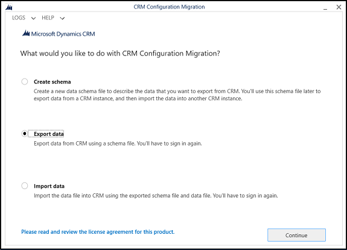
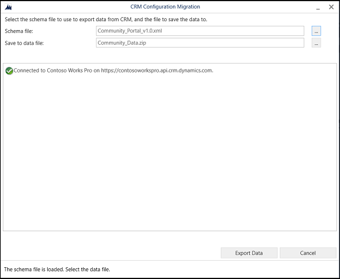
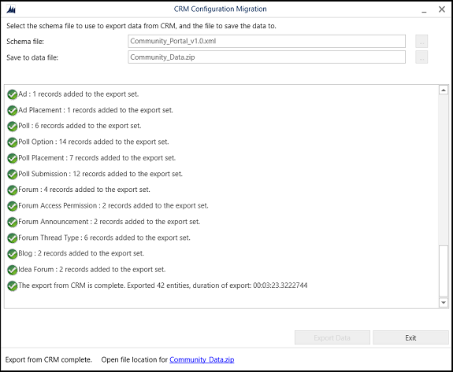
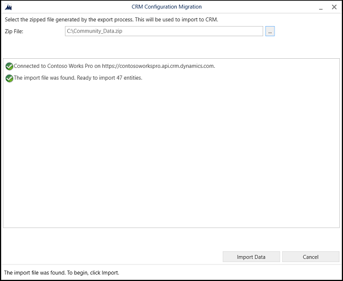

# Migrate website configuration

Power Pages website development involves several configurations and customizations to achieve a desired experience for website end users.

After you complete development or configuration of your website instance, you might want to migrate your latest website configuration from development to testing or the production environments. 

Migration involves exporting the existing configuration from the source Microsoft Dataverse environment, and then importing it into the target Dataverse environment.

## Prepare the target environment

Prepare the target environment if you're using the standard data model. An environment that uses the [enhanced data model](../admin/enhanced-data-model.md) doesn't require these steps. You can proceed to [transferring the website configuration](#transfer-the-website-configuration-to-target-environment).

> [!NOTE]
> - Preparing the target environment is a one-time process. You need to provision a new website to install the managed Power Pages solutions on Dataverse and configure the Power Pages web application. This process also installs default website metadata which is replaced by the website metadata from your source environment.
> - Ensure that the target environment's maximum attachment size is set to the same or greater size as your source environment.
> - The **Maximum file size** setting in the [system settings email tab](/power-platform/admin/system-settings-dialog-box-email-tab) in the environment system settings dialog box determines the maximum size of files.
> - Note the difference between developer, trial, and production **websites** and developer, trial, sandbox, and production **environments**.
> - You can [migrate](migrate-site-configuration.md) a trial, developer, or production website to another trial, developer, or production website on the same or another environment. You need to provision a production **website** on a sandbox or production **environment**.

1. [Provision a new website](../getting-started/create-manage.md) in your target environment. Use the same [website template](../templates/index.md) that you used in your source environment. For example, if you provisioned a site by using the **Dynamics 365 Customer Self-Service** template in your source environment, provision the site by using the **Dynamics 365 Customer Self-Service** template in your target environment.

1. On the *target* environment, use the [Portal Management app](../configure/portal-management-app.md) to delete the newly created website record. This action removes the default website configuration data from the target environment.

    :::image type="content" source="media/migrate-portal-config/delete-website.png" alt-text="Delete website record.":::

1. On the *target* environment, in Power Apps, delete the portal app. This action removes the website currently configured to render the default site.

    > [!NOTE]
    > Don't delete the Portal Management app!

    :::image type="content" source="media/migrate-portal-config/delete-portal.png" alt-text="Delete portal app.":::

## Transfer the website configuration to target environment

[Transfer](#transfer-website-metadata) the site metadata from the source environment by using the Power Platform CLI, the Configuration Migration Tool, or [solutions](../configure/power-pages-solutions.md).

## Reactivate site on target environment

After you transfer the website to the target environment, reactivate the website.

1. On the target environment, on the Power Pages home screen, select **Inactive sites**. You see the website you migrated to the environment.

1. Select **Reactivate**.

    :::image type="content" source="media/migrate-portal-config/reactivate-website.png" alt-text="Reactivate website.":::

1. Enter the **Reactivated website** name and **Create a web address** or accept the default values.

1. Select **Done**.

1. The website updates from the source environment appear in this new target environment. Going forward, you can transfer configuration from your source to target environments by transferring the website configuration data.

> [!NOTE]
> A website that appears in the **Inactive sites** list on the Power Pages home page also appears in the list of **Active Websites** in the [Portal Management app](../configure/portal-management-app.md).

## Transfer website metadata

# [Solutions](#tab/sol)

If you configure your website by using the [enhanced data model](../admin/enhanced-data-model.md), you can transfer the website configuration by using Power Platform solutions. For more information, see [Using solutions with Power Pages](../configure/power-pages-solutions.md).

> [!NOTE]
> Make sure the target environment also has the [enhanced data model](../admin/enhanced-data-model.md) enabled.

# [Power Platform CLI](#tab/CLI)

### Transfer website configuration by using Power Platform CLI

Microsoft Power Platform CLI provides many features specifically for [Power Pages](/power-apps/maker/portals/power-apps-cli). These commands allow you to download site configuration from a source environment and transfer it to a target environment. You can also incorporate these commands into your ALM processes.

1. Create Power Platform CLI authentication profiles to connect to both your source and target environments. Give the profiles names to easily identify the target and source environments.

    ```powershell
    pac auth create --name [name] --url [environment url]
    ```

    **Example**

    ```powershell
    pac auth create --name PORTALDEV --url https://contoso-org.crm.dynamics.com
    ```

1. When you create the authentication profiles, each profile has an associated index that you can determine by using the list command.

    ```powershell
    pac auth list
    ```

    :::image type="content" source="media/migrate-portal-config/pac-auth-list.png" alt-text="List of environments.":::

1. Select the Power Platform CLI authentication profile connected to the source environment.

    ```powershell
    pac auth select --index [source environment index]
    ```

    **Example**

    ```powershell
    pac auth select --index 1
    ```

1. Determine the website ID for the source site.

    `pac pages list`

    :::image type="content" source="media/migrate-portal-config/portal-list.png" alt-text="List of websites.":::

1. Download the website configuration data to your local workstation. Use the `--overwrite` option set to `true` if you previously downloaded website configuration to the same path.

    `pac pages download --path [path] --webSiteId [website id]`

    **Example**

    `pac pages download --path c:\paportals\ --webSiteId db9db518-ea5c-ec11-8f8f-00224804e6cd`

1. Select the Power Platform CLI authentication profile connected to the target environment.

    `pac auth select --index [target environment index]`

    **Example**

    `pac auth select --index 2`

1. Upload the website configuration data to the target environment.

    `pac pages upload --path [path]`

    **Example**

    `pac pages upload --path "C:\paportals\portaldev"`


> [!NOTE]
> - The Power Platform CLI tool doesn't migrate Dataverse tables or table schema. Migration might fail with missing elements such as tables and fields when configuration data is mismatched with selected schema.
> - During import, ensure the destination environment contains the same website template type already installed with any other customizations such as tables, fields, forms, or views imported separately as solutions.

# [Configuration Migration Tool](#tab/CMT)

### Transfer website configuration by using the Configuration Migration tool

>[!NOTE]
> The preferred method to transfer website metadata is to use [solutions](../configure/power-pages-solutions.md) or the [Power Platform CLI](#transfer-website-configuration-by-using-power-platform-cli).

To export configuration data, use the Configuration Migration tool and a website-specific configuration schema file. For more information about this tool, see [Manage configuration data](/power-platform/admin/manage-configuration-data).

> [!NOTE]
> - Use the latest version of the Configuration Migration tool. You can download the Configuration Migration tool from NuGet. For more information about downloading the tool, see [Download tools from NuGet](/dynamics365/customer-engagement/developer/download-tools-nuget).
> - The minimum solution version of websites supported by schema files for configuration migration is 8.4.0.275. However, use the latest solution version.
> - Source and destination organizations must have the same default language for the migration to work successfully.

Schema files are available for the following website types:

- **Websites created in an environment with Dataverse**
    - [Custom portal (Blank portal)](https://go.microsoft.com/fwlink/p/?linkid=2110477)
    - [Custom portal (Blank portal)](https://go.microsoft.com/fwlink/p/?linkid=2162831) (for version [9.2.2103.x](/power-apps/maker/portals/versions/package-version-9.2.2103))
    - [Custom portal (Blank portal)](https://go.microsoft.com/fwlink/?linkid=2186536) (for version [9.3.2201.x](/power-apps/maker/portals/versions/package-version-9.2.2103) or higher)

- **Websites created in an environment containing customer engagement apps (such as Dynamics 365 Sales and Dynamics 365 Customer Service)**
    - [Custom portal (Blank portal)](https://go.microsoft.com/fwlink/p/?linkid=2019804)
    - [Custom portal (Blank portal)](https://go.microsoft.com/fwlink/p/?linkid=2162733) (for version [9.2.2103.x](/power-apps/maker/portals/versions/package-version-9.2.2103))
    - [Custom portal (Blank portal)](https://go.microsoft.com/fwlink/?linkid=2186261) (for version [9.3.2201.x](/power-apps/maker/portals/versions/package-version-9.3.2201) or higher)
    - [Community portal](https://go.microsoft.com/fwlink/p/?linkid=2019704)
    - [Customer Self-Service portal](https://go.microsoft.com/fwlink/p/?linkid=2019705)
    - [Partner portal](https://go.microsoft.com/fwlink/p/?linkid=2019803)
    - [Employee Self-Service portal](https://go.microsoft.com/fwlink/p/?linkid=2019802)

The default schema files contain information about website tables, relationships, and uniqueness definitions for each entity. For more information, see [Export website configuration data](#export-website-configuration-data).

After exporting the configuration data, import it into the target environment. For more information, see [Import website configuration data](#import-website-configuration-data).

> [!NOTE]
> - The Configuration Migration tool uses schema to export and import configuration data. The tool doesn't migrate Dataverse tables or table schema. Migration might fail with missing elements such as tables and fields when configuration data doesn't match the selected schema.
> - During export, ensure the source environment contains website tables as specified in the Configuration Migration tool schema file. You can still alter the schema files to add, remove, and modify tables and attributes to migrate a subset of configuration data.
> - During import, ensure the destination environment contains the same website type already installed with any other customizations such as tables, fields, forms, or views imported separately as solutions.

## Export website configuration data

You can export website configuration data from a source system by using website-specific configuration schema files.

1. Download the Configuration Migration tool and extract it to the desired folder.

1. Download the website configuration schema file by using the links provided earlier for your website template type.

1. Double-click the **DataMigrationUtility.exe** file in the 
`<your_folder>\Tools\ConfigurationMigration` folder to run the Configuration Migration tool. Choose **Export data** in the main screen, and then select **Continue**.

    > [!div class=mx-imgBorder]
    > 

1. On **Login**, enter your authentication details to connect to your Dataverse environment. If you want to export data from multiple organizations in the Dataverse environment, select the **Display list of available organizations** check box, and then select **Login**.

1. If you select the **Display list of available organizations** check box, the next screen prompts you to choose the organization that you want to connect to. Select a Dataverse environment to connect to.

    > [!NOTE]
    > If you don't have multiple organizations, this screen isn't displayed.

1. In **Schema file**, browse and select the website-specific configuration schema file to use for the data export.

1. In **Save to data file**, specify the name and location of the data file to export.

    > [!div class=mx-imgBorder]
    > 

1. Select **Export Data**. The screen displays the export progress status and the location of the exported file at the bottom of the screen once the export is complete.

    > [!div class=mx-imgBorder]
    > 

1. Select **Exit** to close the tool.

## Import website configuration data

1. Run the Configuration Migration tool, select **Import data** on the main screen, and then select **Continue**.

    > [!div class=mx-imgBorder]
    > 

1. On **Login**, enter your authentication details to connect to your Dataverse environment. If you want to export data from multiple organizations in the Dataverse environment, select the **Display list of available organizations** check box, and then select **Login**.

1. If you select the **Display list of available organizations** check box, the next screen prompts you to choose the organization that you want to connect to. Select a Dataverse environment to connect to.

    > [!NOTE]
    > - If you don't have multiple organizations, you don't see this screen.
    > - Make sure the portal solution is already installed for the organization where you plan to import the configurations.

1. The next screen prompts you to provide the data file (.zip) to import. Browse to the data file, select it, and then select **Import Data**.

    > [!div class=mx-imgBorder]
    > 

1. The next screen displays the import status of your records. The data import runs in multiple passes to first import the foundation data while queuing up the dependent data, and then import the dependent data in the subsequent passes to handle any data dependencies or linkages. This action ensures clean and consistent data import.

1. Select **Exit** to close the tool.

---

### Create new website using migrated data

If the migration process updates an existing website, you see the updates in the target environment. 

If the migration is for a new website, the migrated website appears in the **Inactive sites** tab on the Power Pages home page.

1. On the target environment, on the Power Pages home screen, select **Inactive sites**. You see the website you migrated to the environment.

1. Select **Reactivate**.

    :::image type="content" source="media/migrate-portal-config/reactivate-website.png" alt-text="Reactivate website.":::

1. Enter the **Reactivated website** name and **Create a web address** or accept the default values.

1. Select **Done**.

## Tenant-to-tenant migration

To move a Power Pages site to another tenant, export the site as part of a solution, delete or reset the site in the source tenant, and then import and activate the site in the target tenant environment.

> [!IMPORTANT]
> Use the Power Platform [Tenant-to-tenant migrations](/power-platform/admin/move-environment-tenant) article for environment-level prerequisites and move steps.

### Plan the move

Identify the tenant-specific configuration that you need to reconfigure. Site connections, app registrations, authentication providers, integrations, and some admin settings don't transfer in a ready-to-use state.

### Move the site configuration

1. Export the site configuration and customizations as part of a solution. To transfer additional configuration data, use the [website metadata transfer steps](#transfer-website-metadata) in this article.

1. Delete or [reset](/power-apps/maker/portals/admin/reset-portal) the site in the source tenant before you move the environment.

1. Complete the environment-level move by following the Power Platform [Tenant-to-tenant migrations](/power-platform/admin/move-environment-tenant) guidance.

1. Import the site solution into the target tenant environment.

1. Activate the imported site from the **Inactive sites** tab in Power Pages. For activation steps, see [Reactivating site on target environment](#reactivate-site-on-target-environment).

1. Reconfigure tenant-specific connections, integrations, runtime features, site data, and admin settings.

1. [Convert the site to production](convert-site.md) after migration is complete.

### Reconfigure connections and integrations

After you activate the site in the target tenant environment, manually reconfigure the connections and integrations that depend on tenant-specific resources.

- Reconfigure site connections because the app registration for the portal host-to-Dataverse connection changes.
- Configure the custom domain and associated SSL certificate.
- Reauthenticate the SharePoint connection.
- Reconfigure Power BI workspace authentication and update workspace IDs referenced in site code.
- Confirm whether Power Automate cloud flow GUIDs are retained after the move. Reconfigure flow references and connections as needed.

### Reconfigure runtime features

Review and reconfigure runtime features that depend on tenant identity, app registrations, or service connections.

- Configure authentication providers, especially providers that depend on the source Microsoft Entra tenant.
- Reconfigure Microsoft Copilot Studio agents.
- Reconfigure cloud flows.
- Reconfigure external apps.

### Migrate site data

Migrate site data that isn't transferred with the site configuration.

- Migrate the authenticated site users, including Dataverse contact records and site-specific data records.
- Migrate other site data required for the target site experience.

### Reconfigure admin settings

Some admin settings return to their default values after migration. Review and configure these settings in the target tenant environment.

- Configure AI features for the target site.
- Reconfigure other features that revert to default values, such as SharePoint, Power BI, and governance settings.
- Reconfigure content delivery network (CDN) and web application firewall (WAF) settings.

> [!NOTE]
> Before you go live, validate all pages, permissions, user access, and integrations in the target tenant environment.

### See also

- [Power Pages support for Microsoft Power Platform CLI](/power-apps/maker/portals/power-apps-cli)
- [Using solutions with Power Pages](../configure/power-pages-solutions.md)
- [Enhanced data model](../admin/enhanced-data-model.md)
- Tenant-to-tenant migration of a [Power Platform environment](/power-platform/admin/move-environment-tenant)
- Tenant-to-tenant migration of [model-driven apps](/dynamics365/admin/move-instance-tenant) in Dynamics 365 such as Sales, Customer Service, Marketing, Field Service, and Project Service Automation
