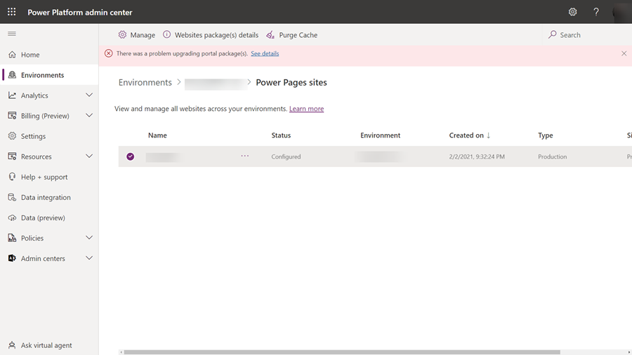
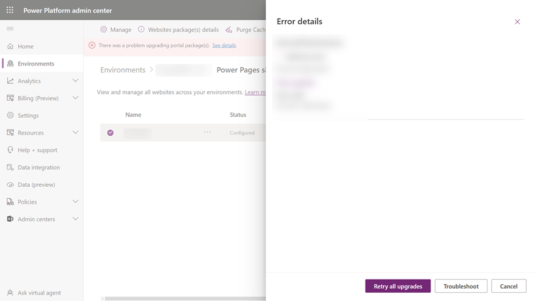

# Update the Power Pages solution

Power Pages sites use solutions from different packages in a Microsoft Dataverse environment. You can use the Power Platform admin center to:

- View the details of installed packages (such as the version details).
- Update installed packages for the selected environment, if a package with a higher version is available.

> [!IMPORTANT]
> - Updating packages might take some time. While the upgrade is in progress, you might see some instability in your site and environment; hence, we recommend that you update packages during off-peak hours.
> - Solutions in a package are upgraded for an environment. Hence, the selected package will be upgraded for all sites in the environment using the package.

## Required permissions

You might see the following error message if you don't have the required permissions to view and update a Power Pages package: "You don't have the permissions to access this portal's environment." More information: [Admin roles required for portal administrative tasks](/power-apps/maker/portals/admin/portal-admin-roles)

## View package details

To view the Power Pages package details:

1. Go to the [Power Platform admin center](https://aka.ms/ppac).

1. Go to **Environments**.

1. Select the environment of your Power Pages site.

1. Select **Resources** and then **Power Pages sites**.

1. Select the Power Pages site for your environment.

1. Select **Websites package(s) details**.

    :::image type="content" source="media/power-platform-admin-center/website-package-details.png" alt-text="Details of portal's packages.":::

1. View the details of the packages for the selected portal.

    :::image type="content" source="media/power-platform-admin-center/website-package-details-info.png" alt-text="Details of portal's packages such as name, version, and installation status":::

## Update a website package

You can use the Power Platform admin center to update website packages, either by choosing to update based on the selected environment or by selecting from the list of websites for a tenant.

### Method 1: Update website packages by using the selected environment

1. Go to the [Power Platform admin center](https://aka.ms/ppac).

1. Go to **Environments**.

1. Select the environment of your Power Pages site.

1. Select **Resources** and then **Power Pages sites**.

1. Select the Power Pages site for your environment.

1. Select **Upgrade now** from the notification at the top of the page that indicates that an update is available. 

### Method 2: Update website packages by using the site list for a tenant

1. Go to the [Power Platform admin center](https://aka.ms/ppac).

1. Select **Power Pages sites** from under the **Resources** tab.

1. Select a website from the list of all sites in a tenant.

1. Select **Check portal package(s) for upgrade**.

    :::image type="content" source="media/power-platform-admin-center/check-upgrades.png" alt-text="Check portal packages for upgrade.":::

1. Update any packages that are available.

    :::image type="content" source="media/power-platform-admin-center/upgrade-packages.png" alt-text="Update portal packages    .":::

## Check package update errors, and retry

If the package update fails, you'll see a notification with a link to more details about the problem.

When you select **See details**, a page appears with more information as shown in the following image.

Select **Retry all upgrades** to try the installation again.

### See also

- [Upgrade a website](upgrade-site.md) 
- [Administer Microsoft Power Platform](/power-platform/admin/admin-documentation)  
- [Manage Dynamics 365 apps](/power-platform/admin/manage-apps)

