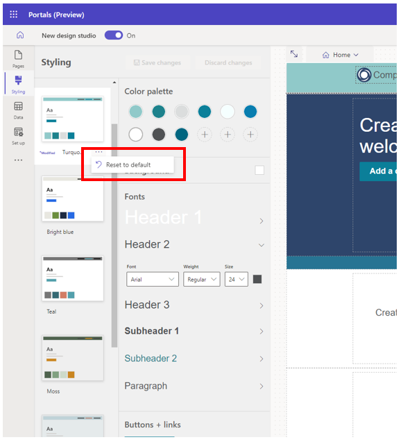
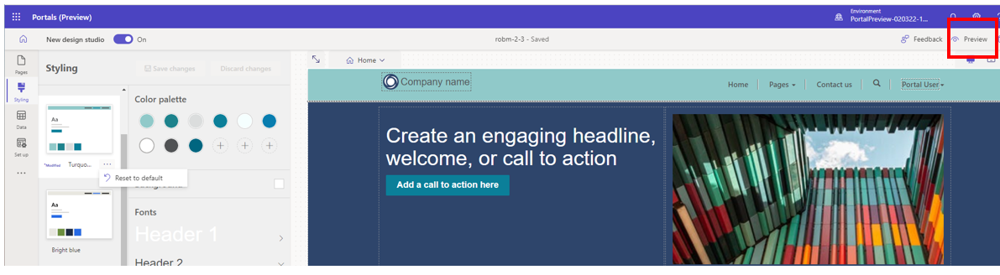

# Style your pages site

In Power Pages you will find a robust set of themes and tools to use to style your site. There are several preset themes that may be applied to your portal.  Use these as a starting point and apply further customization with the styling menu.

1. Sign in to [Power Apps](https://make.powerapps.com/).

1. Select the **Styling** tab from the left navigation pane

    

    - Note the list of choices in the Themes Workspace. Further customization can be done with the Styling Menu.

1. Select one of the preset themes to see how the style is reflected on the canvas workspace to the right.

    - Note the requisite changes in the color palate that occur with each theme change. Each theme has its own palette.

    - Users can adjust the styling menu to make fine-tuned adjustments to each theme. Text options include Font, Weight, Size, and Color.

1. Choose between **Save Changes** or **Discard Changes** after theme edits are made.

    - A modified theme will be noted next to the theme name if and until the theme is reset to preserve changes.

## Resetting a Theme

To **reset a theme** to it's original state, choose the ellipses to open the **Reset to default option**

    

## Viewing Your Page

To see the full page in the studio, select the two arrows to hide the styling options.

    

To see the site as it would appear in production select the Preview icon.

    

You can also use the viewport selector to choose from Web, tablet, and mobile views of the workspace.  

To see the site in the 1.0 Version of Power Pages...

## Theme Mapping

Note that each color on the palate maps to a specific element on the page.  There will always be nine colors for any preset theme and three slots for user selected colors.  If the elements are customized at any point the mapping will no longer hold true unless the theme is reset.

To add a new color or to change an existing color click the "+" sign below and select your color from the options.  This can be done with the color picker, the Hex value, and the RGB values.

    

Once a new color is added to the color palate it can then be used to color components in the context menu

## Areas to be added

## Design and build

- Overview

- Styling (fonts, colors, themes, etc)

- Work with themes

- Basic themes

- Edit CSS

- Next steps

[Edit theme CSS](https://github.com/MicrosoftDocs/powerapps-docs/blob/main/powerapps-docs/maker/portals/edit-css.md)

## See also

[Power Apps portals Studio](https://github.com/MicrosoftDocs/powerapps-docs/blob/main/powerapps-docs/maker/portals/portal-designer-anatomy.md)  
[Create and manage webpages](https://github.com/MicrosoftDocs/powerapps-docs/blob/main/powerapps-docs/maker/portals/create-manage-webpages.md)  
[WYSIWYG editor](https://github.com/MicrosoftDocs/powerapps-docs/blob/main/powerapps-docs/maker/portals/compose-page.md)

## Work in progress

[CSS Workflows Old.pptx](https://microsoft-my.sharepoint.com/:p:/p/robmoyer/ERC0givKHZpMnXTzajEyHwMBTwq8DuMFyQv9iECYaLQvwA?e=rhI7TT)

